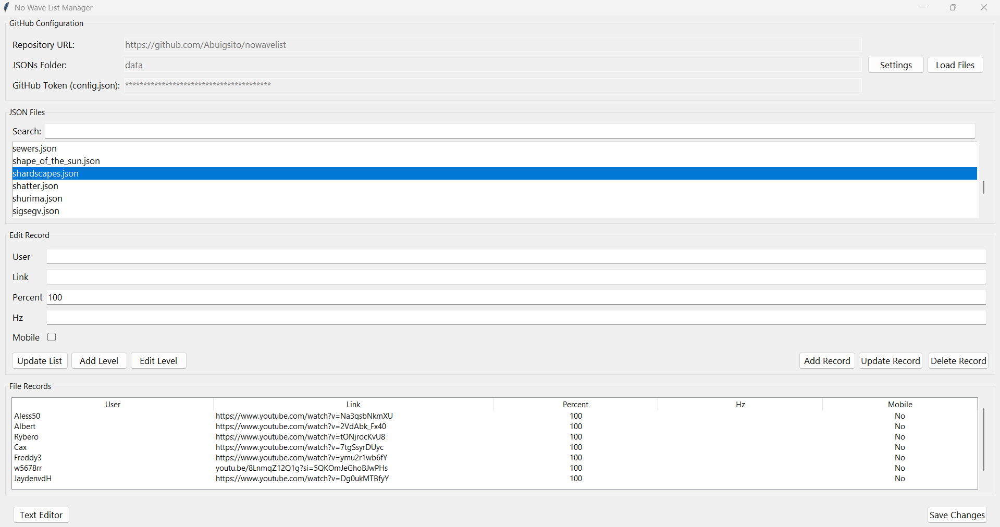
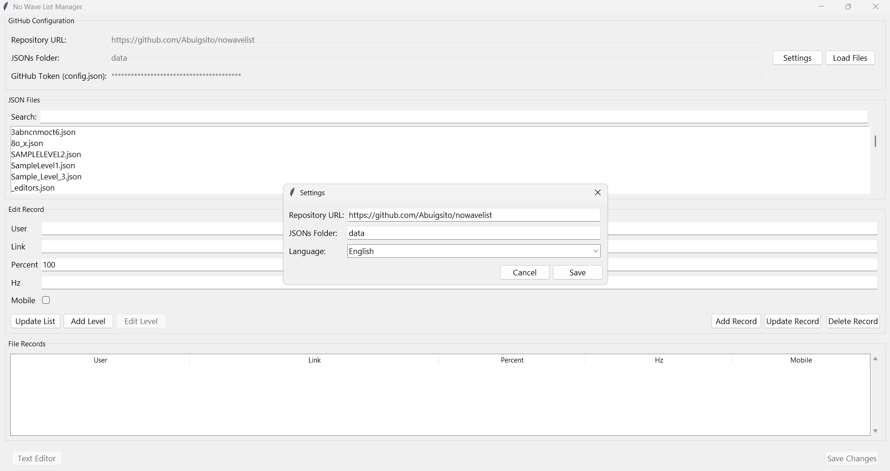
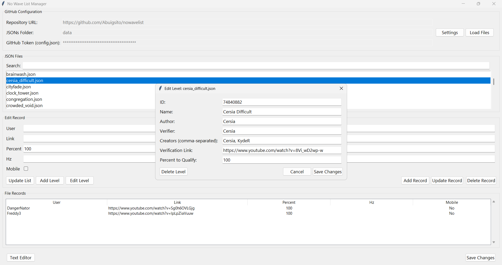

# No Wave List Manager (NWL Manager)

A user-friendly desktop application for Windows to easily manage and edit JSON files for a Geometry Dash list hosted on GitHub. Built with Python and Tkinter, this tool streamlines the process of adding, editing, and deleting records, as well as managing level metadata, without needing to manually edit JSON files.

## Screenshots

Here's a look at the main interface and some of its key features.

**Main Window**
*The main dashboard to view and manage all your list files and their records.*


**Settings & Level Editing**
*Easily configure your repository and edit level metadata in dedicated windows.*
| Settings | Edit Level |
| :---: | :---: |
|  |  |

---

## Features

- **GitHub Integration**: Load and display JSON files directly from a GitHub repository.
- **Record Management**: Add, update, and delete records within a JSON file through a simple form.
- **Level Metadata Editing**: Modify level details like ID, name, author, verifier, and more.
- **List Reordering**: Easily reorder levels using a interface.
- **AREDL API Import**: Quickly populate level data by importing it from the AREDL API using a level ID.
- **Multi-language Support**: Switch between English and Spanish.
- **Persistent Configuration**: All settings (repository, language, etc.) are saved locally in a `config.json` file.
- **Safe & Secure**: Your GitHub token is read from the local configuration and is never displayed or modified by the app, keeping it secure.

---

## Installation

This application is designed for Windows and requires no installation.

1.  Go to the **Releases** page of this repository.
2.  Download the latest `NWLManager.exe` file.
3.  Place the `.exe` in a folder of your choice and run it.

---

## Configuration

Before you can use the application, you need to configure it to point to your GitHub repository and provide an access token.

1.  **Run `NWLManager.exe` once.** This will automatically create a `config.json` file in the same directory.

2.  **Open `config.json`** with a text editor (like Notepad or VS Code). It will look like this:

    ```json
    {
        "repo_url": "https://github.com/Abuigsito/nowavelist",
        "folder_path": "data",
        "language": "es"
    }
    ```

3.  **Add your GitHub Token.** You need to add a `github_token` key to the file. This is required to make changes to your repository.

    -   **Click here to create a new GitHub Personal Access Token (Classic)**.
    -   Give it a name (e.g., "NWL Manager Token").
    -   Set an expiration date.
    -   Under **scopes**, check the `repo` box. This will grant the necessary permissions.
    -   Click "Generate token" and copy the token.

4.  **Update your `config.json`** with the new token. Your final file should look like this:

    ```json
    {
        "repo_url": "https://github.com/YourUsername/YourRepoName",
        "folder_path": "data",
        "language": "en",
        "github_token": "ghp_YOUR_COPIED_TOKEN_HERE"
    }
    ```

    > **Important**: Make sure to replace the `repo_url` with your own repository URL and paste your actual token.

---

## How to Use

1.  **Launch the Application**: Double-click `NWLManager.exe`.

2.  **Load Files**: Click the **"Load Files"** button. The application will connect to your configured GitHub repository and list all the `.json` files found in the specified folder.

3.  **Select a File**: Click on any file from the "JSON Files" listed. The records from that file will appear in the table below.

4.  **Manage Records**:
    -   **To Add**: Fill in the "User", "Link", "Percent", and "Hz" fields, then click **"Add Record"**.
    -   **To Update**: Select a record from the table. Its data will populate the fields. Make your changes and click **"Update Record"**.
    -   **To Delete**: Select a record from the table and click **"Delete Record"**.

5.  **Edit Level Info**:
    -   With a file selected, click **"Edit Level"**.
    -   A new window will open, allowing you to change the level's metadata.
    -   Click "Save Changes" in that window to commit the metadata update.

6.  **Reorder the List**:
    -   Click **"Update List"**.
    -   Select the file that contains the desired order (e.g., `_list.json`).
    -   In the new window, you can add, remove, or reorder the entries.
    -   Click "Save and Apply" to reorder the records in the currently loaded file.

7.  **Save All Changes to GitHub**:
    -   After adding, updating, or reordering records, the changes are only in memory.
    -   To push these changes to your GitHub repository, click the main **"Save Changes"** button at the bottom right.

---

## Building from Source

If you wish to build the application yourself:

1.  Clone the repository.
2.  Install the required packages: `pip install requests pyinstaller`
3.  Run the script: `python NWLmanager.py`

4.  To build the executable, run: `pyinstaller --onefile --windowed --name NWLManager NWLmanager.py`

